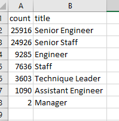
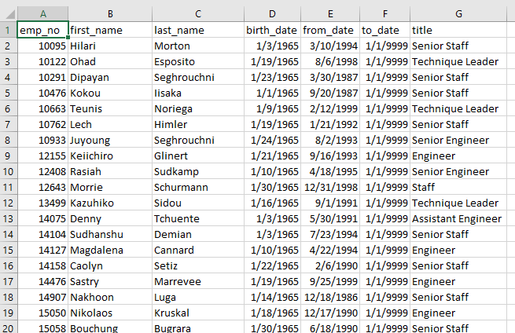

# Pewlett-Hackard-Analysis
You can find the analysis files here: [Employee_database.sql](https://github.com/NedaAJ/Pewlett-Hackard-Analysis/blob/main/Queries/Employee_Database_challenge.sql)

## Analysis Overview
The goal of this study was to construct two tables: one to determine **the number of retiring employees by their job titles**, and the other to identify employees who would benefit to participate in a **mentorship program**. We included information like *employee number, first and laswname, position title, and start and finish dates* in the first table. We added the *employee number, first and last name, birth date, start and finish dates, and position title* to the second sheet.

## Results
### Deliverable 1 - The Number of Retiring Employees by Title
You can find the first table here: [retiring_titles.csv](https://github.com/NedaAJ/Pewlett-Hackard-Analysis/blob/main/Data/retiring_titles.csv)

### Deliverable 2 - The Employees Eligible for the Mentorship Program
You can view the second table here: [mentorship_eligibility.csv](https://github.com/NedaAJ/Pewlett-Hackard-Analysis/blob/main/Data/mentorship_eligibility.csv)

